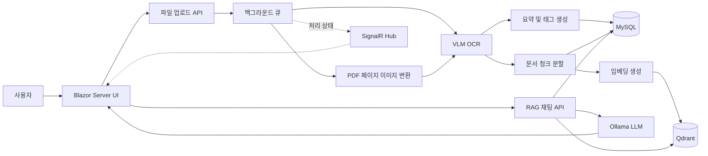

# EDMS

EDMS는 문서를 업로드해 OCR로 텍스트를 추출하고, 요약·태그·임베딩을 생성한 뒤 문서 기반 질의응답(RAG)을 제공하는 전자문서 관리 시스템입니다.

ASP.NET Core 8 및 Blazor Server를 중심으로 구성되어 있으며, MySQL에는 문서/채팅 메타데이터를, Qdrant에는 문서 청크 임베딩을 저장합니다. LLM·VLM·임베딩 생성은 Ollama의 OpenAI 호환 API와 Semantic Kernel을 통해 처리합니다.

> 이 README는 현재 저장소의 구현 상태를 기준으로 작성되었습니다. 실행 전에 아래의 **설정 및 보안 주의사항**과 **현재 구현 범위**를 반드시 확인하세요.

## 주요 기능

- PDF 및 이미지(`.jpg`, `.jpeg`, `.png`) 업로드
- PDF 페이지 이미지 변환 및 페이지 단위 OCR
- OCR 결과의 문서 요약 및 자동 태그 생성
- 문서 텍스트 청크 분할 및 Qdrant 임베딩 저장
- 업로드 처리 상태를 SignalR로 실시간 표시
- 등록 문서 목록, PDF 미리보기 및 다운로드
- 벡터 검색과 LLM을 결합한 문서 기반 스트리밍 답변
- 채팅방 및 대화 이력 MySQL 저장
- Telerik FileManager 기반 업로드 디렉터리 탐색

## 처리 흐름



업로드된 PDF는 Telerik Document Processing으로 페이지별 PNG 이미지로 변환됩니다. OCR 결과는 페이지별로 MySQL에 저장되고, 최대 800자·100자 중첩 단위로 나뉘어 임베딩된 뒤 Qdrant의 `DocFileInfo` 컬렉션에 저장됩니다. 채팅 시에는 질문 임베딩과 유사한 청크를 최대 10개 검색하고, 해당 내용과 출처를 컨텍스트로 사용해 답변을 스트리밍합니다.

## 기술 스택

| 영역 | 기술 |
| --- | --- |
| 런타임 | .NET 8, ASP.NET Core |
| UI | Blazor Server, Telerik UI for Blazor, Bootstrap |
| API/실시간 통신 | ASP.NET Core Web API, SignalR |
| 관계형 데이터베이스 | MySQL, EF Core, Pomelo, Dapper |
| 벡터 데이터베이스 | Qdrant |
| AI 오케스트레이션 | Microsoft Semantic Kernel |
| LLM/VLM/임베딩 | Ollama, OpenAI 호환 API |
| 문서 처리 | Telerik Document Processing, PDF.js |
| 기타 | ClosedXML, Markdig |

현재 코드에 등록된 모델은 다음과 같습니다.

| 용도 | 모델 |
| --- | --- |
| 일반 문서 질의응답 | `gpt-oss:20b` |
| 코드 모델 | `qwen3-coder:30b` |
| 일반 OCR | `qwen3-vl:8b` |
| 고사양 OCR | `qwen3-vl:32b-ocr2` |
| 임베딩 | `qwen3-embedding:0.6b` |

## 프로젝트 구조

```text
EDMS/
├─ Components/
│  ├─ BackGroundServices/  # 업로드 큐, PDF 변환, OCR/임베딩 파이프라인
│  ├─ Controller/          # 파일, 문서, 채팅, LLM API
│  ├─ Database/            # EF Core DbContext 및 Dapper 연결
│  ├─ Extensions/          # Semantic Kernel과 Ollama 등록
│  ├─ Hubs/                # 업로드 진행 상태 SignalR Hub
│  ├─ Models/              # Entity 및 DTO
│  ├─ Pages/               # 로그인, 채팅, 라이브러리, 관리자 UI
│  ├─ Plugins/             # Semantic Kernel 플러그인
│  └─ Service/             # 문서 및 채팅 데이터 서비스
├─ Migrations/             # MySQL 초기 마이그레이션
├─ wwwroot/                # CSS, 이미지, PDF.js 및 업로드 파일
├─ Program.cs              # DI, DB, Qdrant, SignalR, 라우팅 구성
└─ EDMS.csproj             # 패키지 및 대상 프레임워크
```

## 실행 전 요구사항

- [.NET 8 SDK](https://dotnet.microsoft.com/download/dotnet/8.0) 이상
- MySQL 서버
- Qdrant 서버(gRPC 연결 사용)
- Ollama 또는 OpenAI 호환 API 서버
- 위 표에 기재된 모델, 또는 코드에서 대체한 모델
- Telerik UI for Blazor 및 Document Processing 사용 권한
- Telerik NuGet 피드 인증과 유효한 Telerik 라이선스 파일

## 외부 연결 설정

DBMS, Qdrant, Ollama의 주소·포트·인증정보는 저장소에 포함하지 않습니다. 실행 환경에서 다음 환경 변수를 별도로 설정해야 합니다.

| 환경 변수 | 설명 |
| --- | --- |
| `ConnectionStrings__DefaultConnection` | MySQL 전체 연결 문자열 |
| `Qdrant__Host` | Qdrant 호스트 이름 또는 IP |
| `Qdrant__GrpcPort` | Qdrant gRPC 포트 |
| `Ollama__OpenAIEndpoint` | Ollama OpenAI 호환 API의 전체 주소 |
| `Ollama__NativeEndpoint` | Ollama 네이티브 API의 기본 주소 |

`appsettings.json`에는 키 구조만 있으며 값은 비어 있습니다. 운영 값, 사용자 이름, 비밀번호, 사설 IP 및 포트는 환경 변수나 별도 비밀 저장소에서 관리하세요. Telerik 피드 인증정보도 `NuGet.Config`에 저장하지 말고 사용자/CI 환경에 별도로 구성해야 합니다.

## 데이터베이스 준비

초기 마이그레이션은 다음 네 테이블을 생성합니다.

| 테이블 | 역할 |
| --- | --- |
| `doc_file_info` | 문서 파일, 요약, 태그, 저장 경로 |
| `doc_file_page` | 문서 페이지별 OCR 텍스트 |
| `chat_room` | 사용자별 채팅방 |
| `chatting` | 채팅방별 사용자/AI 메시지 |

MySQL 연결 문자열 환경 변수를 먼저 설정한 뒤 프로젝트 디렉터리에서 마이그레이션을 적용합니다.

```powershell
dotnet tool install --global dotnet-ef
dotnet ef database update
```

`dotnet-ef`가 이미 설치되어 있다면 첫 번째 명령은 생략할 수 있습니다. 애플리케이션 시작 시 마이그레이션이 자동 적용되지는 않습니다.

## Ollama 및 Qdrant 준비

Ollama 서버에 현재 구성된 모델을 준비합니다. 모델 이름을 변경하려면 `Components/Extensions/SemanticKernelService.cs`도 함께 수정하세요.

```powershell
ollama pull gpt-oss:20b
ollama pull qwen3-coder:30b
ollama pull qwen3-vl:8b
ollama pull qwen3-vl:32b-ocr2
ollama pull qwen3-embedding:0.6b
```

Qdrant 호스트와 gRPC 포트는 외부 환경 변수로 전달합니다. `DocFileInfo` 컬렉션은 첫 임베딩 저장 시 모델의 벡터 차원에 맞춰 자동 생성됩니다.

## 빌드 및 실행

```powershell
dotnet restore
dotnet build
dotnet run --launch-profile https
```

애플리케이션 바인딩 주소와 포트는 실행 환경 또는 ASP.NET Core 환경 변수로 지정합니다. `launchSettings.json`에는 고정 포트를 저장하지 않습니다.

HTTPS 개발 인증서가 신뢰되지 않은 경우 다음 명령을 한 번 실행합니다.

```powershell
dotnet dev-certs https --trust
```

첫 실행 후 `wwwroot/uploads` 디렉터리는 관리자 화면에서 파일 목록을 불러올 때 사용되며, 파일 저장 시 자동 생성됩니다.

## 화면 및 라우트

| 경로 | 화면 | 설명 |
| --- | --- | --- |
| `/` | 로그인 | 현재는 입력값 검증 없이 메인 화면으로 이동 |
| `/main` | 메인 | 채팅, 라이브러리, 관리자 화면을 전환하는 컨테이너 |
| `/chat` | 채팅 | 단독 채팅 컴포넌트 라우트 |
| `/library` | 라이브러리 | 문서 목록, PDF 미리보기, 다운로드 |
| `/admin` | 관리자 | 디렉터리 탐색, 파일 업로드, 처리 상태 확인 |

## 주요 API

모든 컨트롤러는 `api/[action]` 형식을 사용합니다.

| 메서드 | 경로 | 설명 |
| --- | --- | --- |
| POST | `/api/FileUpload` | 파일을 메모리로 읽어 백그라운드 처리 큐에 등록 |
| POST | `/api/FileSave` | 처리 완료된 원본을 `wwwroot/uploads`에 저장 |
| POST | `/api/GetFileList` | 지정 디렉터리의 파일 트리 조회 |
| POST | `/api/GetDocList` | 등록 문서 목록 조회 |
| POST | `/api/GetTagList` | 저장된 문서 태그 목록 조회 |
| POST | `/api/Chat` | Qdrant 검색 후 RAG 답변 스트리밍 |
| POST | `/api/OCR` | 이미지 OCR |
| POST | `/api/Summary` | 문서 요약 및 태그 생성 |
| POST | `/api/Embedding` | 문서 청크 임베딩 및 Qdrant 저장 |
| POST | `/api/GetChatRoomName` | 첫 메시지 기반 채팅방 제목 생성 |
| POST | `/api/GetChatRoomList` | 사용자 채팅방 목록 조회 |
| POST | `/api/GetChattingList` | 채팅방 메시지 목록 조회 |
| POST | `/api/CreateChatRoom` | 채팅방 생성 |
| POST | `/api/CreateChatting` | 사용자/AI 메시지 저장 |

파일 업로드의 요청 본문 제한은 300MB로 설정되어 있습니다. PDF OCR은 페이지를 최대 4개씩 병렬 처리하며, 작업 상태는 `/fileProcessingHub`의 `progressInfo` 그룹으로 전달됩니다.

## 현재 구현 범위와 제한사항

- 로그인 화면은 인증·인가를 수행하지 않고 `/main`으로 이동합니다.
- 라이브러리의 통합검색 입력 UI는 있으나 실제 검색 서비스 호출은 아직 연결되어 있지 않습니다.
- PDF와 이미지의 OCR·저장·임베딩 흐름은 구현되어 있습니다.
- `.xlsx` 분기는 존재하지만 OCR/DB/Qdrant 저장 흐름이 완료되지 않았습니다.
- 관리자 UI에는 `.doc`, `.xls`가 허용 형식으로 표시되지만 백그라운드 처리 로직은 해당 형식을 분류하지 않습니다.
- 업로드 큐와 채팅 컨텍스트는 프로세스 메모리에 저장되므로 서버 재시작 시 유지되지 않으며, 다중 인스턴스 환경에서 공유되지 않습니다.
- 파일 업로드 경로와 파일 목록 API가 클라이언트에서 전달된 경로를 사용하므로 운영 배포 전 경로 제한과 권한 검증이 필요합니다.
- 자동화 테스트 프로젝트는 포함되어 있지 않습니다.

## 빌드 상태

현재 소스는 다음 명령으로 빌드되며 컴파일 오류는 없습니다.

```powershell
dotnet build EDMS.csproj --no-restore
```

다만 nullable 초기화, 사용 중단 예정 API, 대기하지 않은 비동기 호출 및 Telerik 라이선스 관련 경고가 남아 있습니다. 배포 전 경고를 검토하고 유효한 Telerik 라이선스를 설정하세요.

## 권장 개선 순서

1. 배포 환경별 연결 정보와 NuGet 자격 증명을 비밀 저장소에서 주입
2. ASP.NET Core Identity 또는 사내 인증 체계를 이용한 인증·인가 적용
3. 업로드 경로 화이트리스트, 파일 시그니처 검사, 확장자별 처리 정책 추가
4. `.xlsx`, `.doc`, `.xls` 처리 흐름 완성 또는 UI 허용 형식에서 제거
5. 라이브러리 검색 기능과 문서 삭제 시 MySQL/Qdrant 동기화 구현
6. 영속 작업 큐, 분산 캐시 및 구조화 로깅 도입
7. 단위·통합 테스트와 배포 환경별 설정 추가
