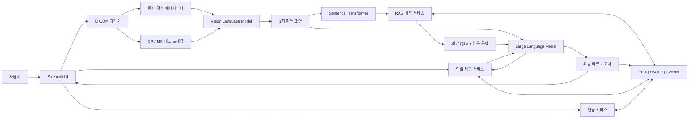
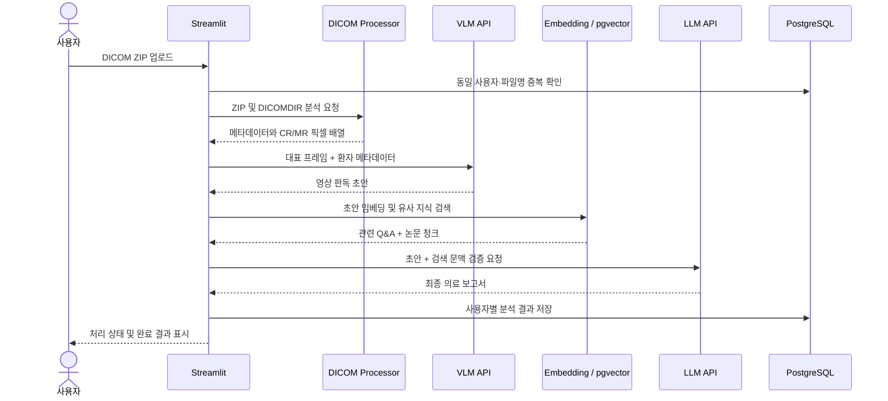
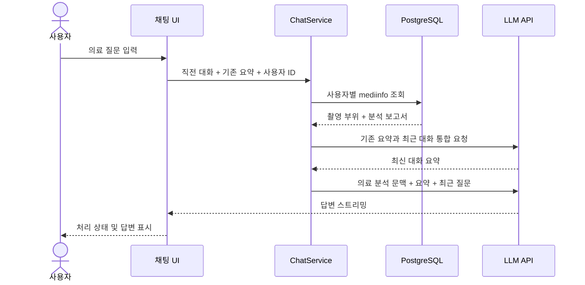
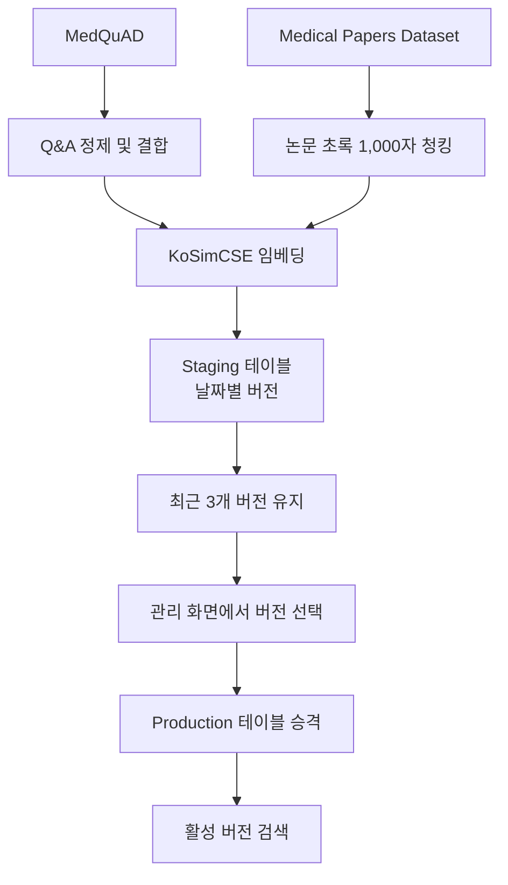

# MedicalAI

> DICOM 의료 영상을 분석하고, 의료 지식 검색(RAG)을 통해 AI 판독 초안을 검증하는 Streamlit 기반 의료 영상 연구 프로젝트

MedicalAI는 DICOMDIR가 포함된 의료 영상 ZIP 파일에서 환자 메타데이터와 영상 프레임을 추출하고, Vision Language Model(VLM)이 생성한 판독 초안을 의료 Q&A 및 논문 데이터에 기반한 Retrieval-Augmented Generation(RAG)으로 보강한 뒤, Large Language Model(LLM)을 통해 최종 보고서 형태로 정리하는 애플리케이션입니다. 저장된 사용자별 분석 결과를 대화 문맥으로 활용하는 의료 채팅 인터페이스도 제공합니다.

현재 프로젝트는 **연구·학습 목적의 프로토타입**입니다. 생성 결과는 의료진의 진단이나 소견을 대체하지 않으며, 실제 임상 의사결정에 사용해서는 안 됩니다.

## 핵심 목표

의료 영상 AI는 영상을 해석하는 능력뿐 아니라 결과의 근거와 일관성을 함께 관리해야 합니다. MedicalAI는 다음 흐름을 하나의 애플리케이션으로 연결하는 것을 목표로 합니다.

1. DICOM 데이터를 안전하게 읽고 환자·검사 메타데이터를 구조화합니다.
2. CR 및 MR 영상에서 대표 프레임을 선택해 멀티모달 모델에 전달합니다.
3. VLM이 영상 기반의 1차 판독 초안을 생성합니다.
4. 초안을 임베딩하고, 벡터 데이터베이스에서 관련 의료 Q&A와 논문 문맥을 검색합니다.
5. LLM이 검색 문맥과 초안을 비교해 최종 의료 보고서 형식으로 정리합니다.
6. 분석 결과와 RAG 데이터 버전을 PostgreSQL에 저장하고 관리합니다.
7. 사용자별 의료 분석 결과와 요약된 대화 문맥을 바탕으로 후속 의료 질문에 스트리밍으로 답변합니다.

## 주요 기능

### DICOM 영상 분석

- `DICOMDIR`가 포함된 ZIP 파일 업로드
- 환자명, 환자 ID, 검사 일자, 촬영 부위 자동 추출
- CR(Computed Radiography) 및 MR(Magnetic Resonance) 프레임 수집
- 검사 프레임 수에 따라 대표 슬라이스를 샘플링
- 선택한 프레임을 PNG/Base64로 변환해 VLM에 전달
- 촬영 부위가 확인되지 않은 경우 AI를 통한 부위 분류 보조

### 하이브리드 AI 판독

- VLM을 이용한 영상 기반 판독 초안 생성
- 초안 텍스트를 한국어 문장 임베딩 모델로 벡터화
- pgvector 코사인 거리 연산을 이용한 유사 의료 지식 검색
- 의료 Q&A 1건과 논문 청크 1건을 참조 문맥으로 구성
- LLM을 이용한 초안 검증 및 최종 보고서 생성
- 처리 상태를 Streamlit UI에 단계별로 표시

### RAG 지식 파이프라인

- Hugging Face의 의료 Q&A 및 의학 논문 데이터셋 수집
- Q&A 질문·답변 결합 및 논문 초록 청킹
- `BM-K/KoSimCSE-roberta-multitask` 기반 768차원 임베딩 생성
- staging 테이블에 날짜별 버전으로 적재
- 최근 3개 staging 버전 유지
- 선택한 버전을 production 테이블로 승격하고 활성 버전 관리

### 사용자 및 결과 관리

- Streamlit 기반 로그인 화면
- JWT 발급 및 쿠키 기반 로그인 세션 유지
- 사용자별 분석 파일 중복 확인
- 사용자별 DICOM 분석 결과 저장
- 수집한 RAG 데이터와 활성 버전 조회

### 의료 데이터 기반 채팅

- 로그인한 사용자의 `mediinfo` 분석 결과를 조회해 시스템 문맥으로 구성
- 저장된 촬영 부위와 분석 보고서를 바탕으로 후속 질문 처리
- 직전 AI 답변과 현재 사용자 질문을 최근 대화 문맥으로 유지
- 기존 요약과 최근 대화를 LLM으로 통합해 세션 내 장기 문맥 압축
- 질문 분석, 의료 데이터 조회, 요약, LLM 전달 상태를 UI에 단계별 표시
- 생성되는 답변을 Streamlit 채팅 화면에 실시간 스트리밍

## 전체 아키텍처



### 계층별 역할

| 계층 | 주요 파일 | 역할 |
| --- | --- | --- |
| Presentation | `home.py`, `view/` | 페이지 라우팅, 로그인, DICOM 업로드, 채팅, 분석 진행 상태와 결과 표시 |
| Service | `services/` | 인증, 의료 데이터 저장, 의료 채팅 문맥 구성, RAG 데이터 동기화·버전 관리, 검색 흐름 조정 |
| AI / Processing | `modules/ai_processor.py` | VLM 요청, RAG 연결, LLM 검증 및 스트리밍 응답 처리 |
| DICOM | `modules/dicomdir_processor.py` | ZIP/DICOMDIR 탐색, 메타데이터와 픽셀 배열 추출 |
| Embedding | `modules/sentence_transformer.py` | 텍스트를 768차원 임베딩으로 변환 |
| Persistence | `modules/db_repository.py` | PostgreSQL 커넥션 풀과 쿼리·트랜잭션 공통 처리 |
| Domain Model | `models/` | 사용자, 분석 결과, AI 요청, RAG 원천 데이터 DTO 정의 |
| Database Design | `database/medicalAI.vuerd` | ERD 설계 파일 |

## 의료 영상 분석 흐름



### 1. DICOM 전처리

`process_dicom_zip()`은 업로드된 ZIP을 메모리에서 열고 `DICOMDIR` 및 참조 영상 파일을 찾습니다. DICOM 디렉터리 레코드를 순회하면서 `PATIENT`, `STUDY`, `SERIES`, `IMAGE` 정보를 결합하고 유효한 2차원 이상의 픽셀 배열을 modality별 버퍼에 저장합니다.

현재 픽셀 버퍼는 `CR`, `MR`을 대상으로 구성되어 있습니다. 프레임이 많은 경우 전체 볼륨을 모두 전송하지 않고 일정 비율의 대표 슬라이스를 선택해 추론 비용과 요청 크기를 줄입니다.

### 2. VLM 초안 생성

선택한 프레임은 Matplotlib으로 렌더링한 뒤 PNG 형식의 Base64 문자열로 변환됩니다. 환자 정보, 검사 일자, modality별 해석 지침과 함께 OpenAI 호환 스트리밍 API 형식으로 VLM에 전달합니다.

촬영 부위가 `UNKNOWN`인 경우 모델은 판독 초안과 함께 `SHOULDER`, `KNEE`, `HIP`, `ANKLE`, `WRIST`, `UNKNOWN` 중 하나를 구조화된 JSON으로 반환하도록 요청받습니다.

### 3. RAG 검색

VLM 초안을 Sentence Transformer로 임베딩한 후 활성 production 버전의 두 지식 저장소를 검색합니다.

- 의료 Q&A: 질문과 전문가 답변
- 의료 논문: 논문명, 초록 청크, 페이지 정보

PostgreSQL의 pgvector 거리 연산자 `<=>`를 사용해 각 저장소에서 가장 유사한 문서 1건을 선택하고, 이를 최종 검증용 컨텍스트로 구성합니다.

### 4. LLM 검증

LLM은 VLM 초안과 검색된 의료 지식을 함께 입력받습니다. 검색 결과가 영상 또는 해부학적 부위와 관련이 없으면 해당 문맥을 버리고, 관련성이 있는 경우에만 초안의 모순이나 과도한 추론을 교정하도록 프롬프트가 구성되어 있습니다. 최종 출력은 검증 과정이나 내부 추론을 제외한 의료 보고서 본문입니다.

## 의료 채팅 흐름



채팅 화면은 전체 메시지를 Streamlit 세션에 표시하면서, LLM 요청에는 직전 AI 답변과 현재 질문을 전달합니다. `ChatService`는 기존 대화 요약과 최근 대화를 새로운 요약으로 통합하고, 로그인한 사용자의 `mediinfo`에서 촬영 부위와 분석 보고서를 조회해 시스템 문맥에 추가합니다. 생성된 요약은 세션 상태에 보관되어 다음 질문의 문맥으로 재사용됩니다.

현재 채팅 기록과 요약은 데이터베이스에 영구 저장되지 않으며 브라우저 세션 범위에서만 유지됩니다. 해당 사용자에게 저장된 의료 분석 결과가 없어도 일반 LLM 질의는 계속 진행됩니다.

## RAG 데이터 수명 주기



사용하는 기본 데이터셋과 모델은 `config.py`에서 관리합니다.

| 구분 | 기본값 |
| --- | --- |
| Q&A 데이터셋 | `lavita/MedQuAD` |
| 논문 데이터셋 | `ahmedabdelwahed/Medical_papers_title_and_abstract_NLP_dataset` |
| 임베딩 모델 | `BM-K/KoSimCSE-roberta-multitask` |
| 임베딩 차원 | 768 |
| VLM / LLM | OpenAI 호환 스트리밍 엔드포인트에 연결된 `qwen3-vl:8b-instruct` |

## 데이터베이스 구성

MedicalAI는 PostgreSQL과 `pgvector` 확장을 사용합니다.

| 테이블 | 목적 |
| --- | --- |
| `member` | 로그인 계정 정보 |
| `member_profile` | 사용자 프로필 |
| `mediinfo` | 사용자별 영상 파일, modality, 촬영 부위, 분석 보고서 |
| `medical_qa_knowledge_staging` | 날짜별 Q&A 수집·임베딩 결과 |
| `medical_paper_chunks_staging` | 날짜별 논문 청크·임베딩 결과 |
| `prod_version_info` | production 지식 버전과 활성 상태 |
| `medical_qa_knowledge_prod` | 검색에 사용되는 Q&A 지식 |
| `medical_paper_chunks_prod` | 검색에 사용되는 논문 지식 |

ERD 원본은 [`database/medicalAI.vuerd`](database/medicalAI.vuerd)에서 확인할 수 있습니다. 현재 저장소에는 DB를 자동 생성하는 SQL migration이 포함되어 있지 않으므로, 실행 전 ERD와 서비스 쿼리를 기준으로 스키마를 준비해야 합니다. 두 임베딩 컬럼은 모델 출력과 동일한 `vector(768)` 타입이어야 합니다.

## 프로젝트 구조

```text
MedicalAI/
├── home.py                         # Streamlit 진입점 및 페이지 라우팅
├── config.py                       # AI 엔드포인트, 모델, 추론 설정
├── requirements.txt                # Python 의존성
├── database/
│   └── medicalAI.vuerd             # 데이터베이스 ERD
├── models/
│   ├── ai_payload.py               # AI API 요청 모델
│   ├── chatDto.py                  # 채팅 DTO
│   ├── mediinfo.py                 # 의료 분석 및 RAG 데이터 모델
│   └── member.py                   # 사용자·세션 모델
├── modules/
│   ├── ai_processor.py             # VLM → RAG → LLM 추론 파이프라인
│   ├── db_repository.py            # PostgreSQL 연결 및 공통 쿼리
│   ├── dicomdir_processor.py       # DICOMDIR/픽셀 처리
│   └── sentence_transformer.py     # 임베딩 생성
├── services/
│   ├── chat_service.py             # 의료 데이터 조회, 대화 요약 및 LLM 채팅
│   ├── medical_service.py          # 분석 저장 및 RAG 버전 관리
│   ├── member_service.py           # 로그인 및 JWT 처리
│   └── rag_service.py              # pgvector 유사도 검색
├── view/
│   ├── login.py                    # 로그인
│   ├── lobby.py                    # RAG 동기화 및 버전 관리
│   ├── MRI_Parsing.py              # DICOM 업로드와 판독
│   └── chat.py                     # 의료 채팅 UI 및 스트리밍 응답 표시
└── practice/                       # 기능 검증용 실험 스크립트
```

## 시작하기

### 사전 요구 사항

- Python 3.10 이상
- PostgreSQL
- PostgreSQL `vector` 확장(pgvector)
- VLM/LLM을 제공하는 OpenAI 호환 스트리밍 API 엔드포인트
- Hugging Face 모델 및 데이터셋을 내려받을 수 있는 네트워크 환경

GPU는 필수는 아니지만 임베딩 생성량이 많아질수록 CPU 환경에서는 초기 RAG 동기화에 상당한 시간이 걸릴 수 있습니다.

### 1. 저장소 복제 및 가상환경 생성

```bash
git clone <repository-url>
cd MedicalAI

python -m venv .venv
```

Windows PowerShell:

```powershell
.venv\Scripts\Activate.ps1
```

macOS / Linux:

```bash
source .venv/bin/activate
```

### 2. 의존성 설치

```bash
python -m pip install --upgrade pip
pip install -r requirements.txt
```

### 3. PostgreSQL 및 pgvector 준비

대상 데이터베이스에서 pgvector 확장을 활성화합니다.

```sql
CREATE EXTENSION IF NOT EXISTS vector;
```

이후 [`database/medicalAI.vuerd`](database/medicalAI.vuerd)의 ERD를 참고해 필요한 테이블과 관계를 생성합니다. 현재 자동 migration은 제공되지 않습니다.

### 4. 환경 변수 설정

프로젝트 루트에 `.env` 파일을 만들고 다음 값을 설정합니다.

```dotenv
CONNECTION_STRING=postgresql://<user>:<password>@<host>:<port>/<database>
JWT_SECRET_KEY=<long-random-secret>
```

| 변수 | 설명 |
| --- | --- |
| `CONNECTION_STRING` | psycopg connection pool에서 사용할 PostgreSQL 접속 문자열 |
| `JWT_SECRET_KEY` | 로그인 토큰 서명에 사용하는 비밀 키 |

VLM/LLM API URL과 모델명, 컨텍스트 크기, 생성 토큰 수, temperature는 현재 `config.py`에서 설정합니다. 배포 환경에서는 API URL도 환경 변수로 분리하고, 비밀 값이나 내부 주소를 저장소에 커밋하지 않는 것을 권장합니다.

### 5. 애플리케이션 실행

```bash
streamlit run home.py
```

브라우저에서 Streamlit이 안내하는 로컬 주소로 접속합니다.

### 6. 기본 사용 순서

1. PostgreSQL에 테스트 사용자와 프로필을 준비합니다.
2. 로그인합니다.
3. 로비에서 Hugging Face 데이터를 동기화합니다.
4. 수집된 날짜 버전을 선택해 production 활성 버전으로 승격합니다.
5. 파일 분석 화면에서 `DICOMDIR`가 포함된 ZIP 파일을 업로드합니다.
6. VLM 분석, RAG 검색, LLM 검증이 완료되면 결과가 사용자 계정에 저장됩니다.
7. 채팅 화면에서 저장된 분석 결과를 바탕으로 후속 의료 질문을 입력합니다.

## 설정

주요 추론 설정은 `config.py`에 정의되어 있습니다.

| 설정 | 설명 |
| --- | --- |
| `OLLAMA_VLM_API_URL` | VLM 요청 엔드포인트 |
| `OLLAMA_LLM_API_URL` | LLM 요청 엔드포인트 |
| `VLM_MODEL`, `LLM_MODEL` | 호출할 모델 이름 |
| `VLM_NUM_PREDICT`, `LLM_NUM_PREDICT` | 최대 생성 토큰 관련 옵션 |
| `VLM_NUM_CTX`, `LLM_NUM_CTX` | 모델 컨텍스트 크기 |
| `VLM_THINK`, `LLM_THINK` | 서버가 지원하는 reasoning 옵션 |
| `DEFAULT_TEMPERATURE` | 생성 temperature |
| `DEFAULT_EMBEDDING_MODEL` | RAG 임베딩 모델 |

AI 서버는 Server-Sent Events 형식의 스트리밍 응답을 반환해야 하며, 각 이벤트는 `data:` 접두사와 OpenAI 스타일 `choices[].delta.content` 구조를 사용해야 합니다. 스트림 종료는 `data: [DONE]`으로 처리합니다.

## 현재 구현 상태

| 영역 | 상태 | 비고 |
| --- | --- | --- |
| 로그인 및 JWT 세션 | 구현 | 인증 구조의 보안 강화 필요 |
| DICOMDIR ZIP 파싱 | 구현 | 현재 CR/MR 중심 |
| VLM 판독 초안 | 구현 | 외부 AI 엔드포인트 필요 |
| pgvector RAG 검색 | 구현 | 활성 production 버전 필요 |
| LLM 최종 검증 | 구현 | 스트리밍 API 필요 |
| 분석 결과 저장 | 구현 | 사용자·파일명 기준 중복 확인 |
| RAG 데이터 동기화 | 구현 | 대용량 적재 최적화 필요 |
| RAG 버전 관리 | 구현 | staging 최근 3개 버전 유지 |
| 의료 채팅 | 구현 중 | 사용자별 분석 결과 연동, 대화 요약, 응답 스트리밍 |

## 알려진 제약과 개선 과제

- DICOM 처리 로직은 현재 `CR`, `MR` modality를 중심으로 작성되어 있으며 다른 modality에 대한 일반화가 필요합니다.
- ZIP 파일 구조, 누락된 DICOM 태그, 압축 전송 구문 및 픽셀 디코더 호환성에 대한 예외 처리를 강화해야 합니다.
- 대표 슬라이스는 규칙 기반 비율 샘플링으로 선택되며 병변 중심 선택을 보장하지 않습니다.
- RAG 검색은 현재 Q&A와 논문에서 각각 Top-1만 사용합니다. Top-k, 재순위화, metadata filter, 유사도 임계값 도입이 필요합니다.
- 임베딩 모델을 요청마다 로드하므로 캐싱 또는 장기 실행 모델 서버로 분리할 필요가 있습니다.
- RAG 적재가 개별 INSERT 중심이므로 batch insert 또는 `COPY` 기반 최적화가 필요합니다.
- AI API 엔드포인트가 코드 설정에 포함되어 있어 환경 변수 기반 설정으로 이전해야 합니다.
- 로그인 비밀번호 비교가 평문 방식이므로 Argon2 또는 bcrypt 기반 단방향 해시로 변경해야 합니다.
- 업로드 파일 크기 제한, 악성 ZIP 방어, DICOM 비식별화, 감사 로그 및 접근 제어가 필요합니다.
- 의료 채팅의 전체 기록과 요약은 현재 Streamlit 세션에만 보관되며 서버 재시작, 로그아웃 또는 세션 종료 후 복원되지 않습니다.
- 의료 채팅은 여러 분석 결과의 촬영 부위를 함께 표시하지만, 분석 본문은 현재 조회 결과의 첫 번째 레코드를 문맥으로 사용합니다. 질문별 검사 선택과 관련 기록 검색이 필요합니다.
- 채팅 중 DB 또는 AI API 호출 실패 시 사용자 안내와 세션 상태 복구를 위한 예외 처리를 강화해야 합니다.

## 보안 및 의료 데이터 주의사항

이 프로젝트는 환자 식별 정보가 포함될 수 있는 DICOM 데이터를 처리합니다. 실제 데이터를 사용하기 전에 반드시 다음 사항을 검토해야 합니다.

- 개발·시연에는 비식별화된 데이터만 사용합니다.
- `.env`, 데이터베이스 접속 정보, JWT 키, AI API 주소를 Git에 커밋하지 않습니다.
- 외부 AI 서버로 영상을 전송하기 전 환자 동의, 기관 정책, 적용 법규와 데이터 처리 계약을 확인합니다.
- 전송 및 저장 구간 암호화, 최소 권한, 접근 로그, 보존 기간과 안전한 삭제 정책을 적용합니다.
- 모델 출력은 환각, 누락, 잘못된 해부학적 판단을 포함할 수 있으므로 자격을 갖춘 의료진이 검토해야 합니다.
- 임상 배포 전 성능 검증, 편향 평가, 위험 관리, 규제 및 의료기기 해당 여부 검토가 필요합니다.

## 로드맵

- [ ] DB migration 및 초기 관리자/테스트 데이터 스크립트 제공
- [ ] 비밀번호 해시, 권한 분리, 로그아웃 및 토큰 폐기 구현
- [ ] AI 및 데이터셋 설정의 완전한 환경 변수화
- [ ] DICOM 비식별화와 업로드 보안 검증 추가
- [ ] modality별 처리 전략 및 슬라이스 선택 알고리즘 개선
- [ ] RAG Top-k, metadata filter, reranker 및 출처 표시 도입
- [ ] 임베딩 모델 캐싱과 대량 DB 적재 최적화
- [ ] 의료 채팅 기록 영구 저장, 검사 선택 및 관련 분석 결과 검색 추가
- [ ] 단위·통합·E2E 테스트와 CI 파이프라인 구축
- [ ] 모델 품질 평가 지표와 임상 검토 워크플로 추가

---

**MedicalAI는 의료진의 판단을 보조하기 위한 연구용 소프트웨어이며, 진단·치료를 제공하는 의료기기가 아닙니다.**
